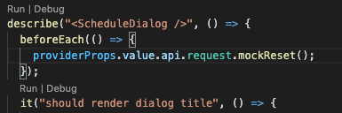

# Testing

### UI Unit Testing

#### Intro

Unit testing serves two goals:  
1. Automated QA for our own code that should include happy flows as well as edge cases.  
2. Defending the logic and functionality of our components eventually turning our code more robust and flexible for future changes.   
Unit test should be as granular as possible to examine the specific functionality we are working on. We should also avoid testing parts of the application that are beyond the scope of our task or third party code bases.  
For instance, if my component should send a GET request I should not test the request/response of the GET request \(because that would be the responsibility of the HTTP client my app uses\). I should test what parameters my component passed to the HTTP client.  
An important by product of this approach would be code decoupling and cohesion.  
Ideally, unit test should be part of the CI/CD and abort commits that break existing tests.

#### Tech Stack

In `hello-cmp/client` we use [Jest](https://jestjs.io/) and and [react-testing-library](https://testing-library.com/docs/react-testing-library/intro/) as testing frameworks.   
To initiate all tests suits run `yarn test:unit` from the `client` dir. To run or debug specific test you can use vs-code extension [Jest Runner](https://marketplace.visualstudio.com/items?itemName=firsttris.vscode-jest-runner) with this configuration:

```text
    "jestrunner.configPath": "client/jest.config.ts",
    "jestrunner.projectPath": "PATH_TO_PROJECT/hello-cmp/client",
    "jestrunner.jestPath": "PATH_TO_PROJECT/hello-cmp/client/node_modules/jest/bin/jest.js",
    "[typescript]": {
        "editor.defaultFormatter": "esbenp.prettier-vscode"
    },
    "jestrunner.jestCommand": "jest --env=jest-environment-jsdom-sixteen"
```

This extension will let you run/debug test from vs-code by clicking run \| debug button above each test or test suite  




To add a new test create a file with the pattern NAME.test.SUFFIX and jest will run test suites inside this file.  
You can see basic test example at `client/src/Pages/CloudAnalytics/dialogs/scheduleDialog/ScheduleDialog.test.tsx`  
And explore official docs as well.

